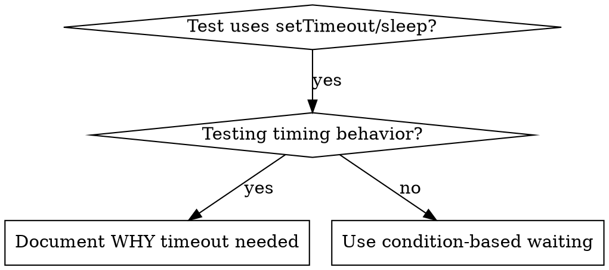

# Condition-Based Waiting

## Overview

Flaky tests often guess at timing with arbitrary delays. This creates race conditions where tests pass on fast machines but fail under load or in CI.

**Core principle:** Wait for the actual condition you care about, not a guess about how long it takes.

## When to Use



**Use when:**
- Tests have arbitrary delays (`setTimeout`, `sleep`, `time.sleep()`)
- Tests are flaky (pass sometimes, fail under load)
- Tests timeout when run in parallel
- Waiting for async operations to complete

**Don't use when:**
- Testing actual timing behavior (debounce, throttle intervals)
- Always document WHY if using arbitrary timeout

## Core Pattern

**Go:**

```go
// BEFORE: Guessing at timing
time.Sleep(50 * time.Millisecond)
result := getResult()
if result == nil {
    t.Fatal("expected result")
}

// AFTER: Waiting for condition
result := waitFor(t, func() any {
    return getResult()
}, "result to be available")
```

**TypeScript:**

```typescript
// BEFORE: Guessing at timing
await new Promise(r => setTimeout(r, 50));
const result = getResult();
expect(result).toBeDefined();

// AFTER: Waiting for condition
await waitFor(() => getResult() !== undefined);
const result = getResult();
expect(result).toBeDefined();
```

## Quick Patterns

| Scenario | Go Pattern | TypeScript Pattern |
|----------|-----------|-------------------|
| Wait for event | `waitFor(t, func() any { return findEvent(events, "DONE") }, "DONE event")` | `waitFor(() => events.find(e => e.type === 'DONE'))` |
| Wait for state | `waitFor(t, func() any { if machine.State == "ready" { return true }; return nil }, "ready state")` | `waitFor(() => machine.state === 'ready')` |
| Wait for count | `waitFor(t, func() any { if len(items) >= 5 { return true }; return nil }, "5 items")` | `waitFor(() => items.length >= 5)` |
| Wait for file | `waitFor(t, func() any { if _, err := os.Stat(path); err == nil { return true }; return nil }, "file exists")` | `waitFor(() => fs.existsSync(path))` |

## Go Implementation

```go
func waitFor(t *testing.T, condition func() any, description string, timeout ...time.Duration) any {
    t.Helper()
    maxWait := 5 * time.Second
    if len(timeout) > 0 {
        maxWait = timeout[0]
    }
    deadline := time.Now().Add(maxWait)

    for time.Now().Before(deadline) {
        if result := condition(); result != nil && result != false {
            return result
        }
        time.Sleep(10 * time.Millisecond) // Poll every 10ms
    }
    t.Fatalf("timeout waiting for %s after %v", description, maxWait)
    return nil
}
```

## TypeScript Implementation

```typescript
async function waitFor<T>(
  condition: () => T | undefined | null | false,
  description: string,
  timeoutMs = 5000
): Promise<T> {
  const startTime = Date.now();
  while (true) {
    const result = condition();
    if (result) return result;
    if (Date.now() - startTime > timeoutMs) {
      throw new Error(`Timeout waiting for ${description} after ${timeoutMs}ms`);
    }
    await new Promise(r => setTimeout(r, 10)); // Poll every 10ms
  }
}
```

## Common Mistakes

**Polling too fast:** `time.Sleep(1ms)` / `setTimeout(check, 1)` — wastes CPU
**Fix:** Poll every 10ms

**No timeout:** Loop forever if condition never met
**Fix:** Always include timeout with clear error

**Stale data:** Cache state before loop
**Fix:** Call getter inside loop for fresh data

## When Arbitrary Timeout IS Correct

**Go:**

```go
// Tool ticks every 100ms — need 2 ticks to verify partial output
waitFor(t, func() any { return firstEvent() }, "first event")  // First: wait for condition
time.Sleep(200 * time.Millisecond)                              // Then: wait for timed behavior
// 200ms = 2 ticks at 100ms intervals — documented and justified
```

**Requirements:**
1. First wait for triggering condition
2. Based on known timing (not guessing)
3. Comment explaining WHY
