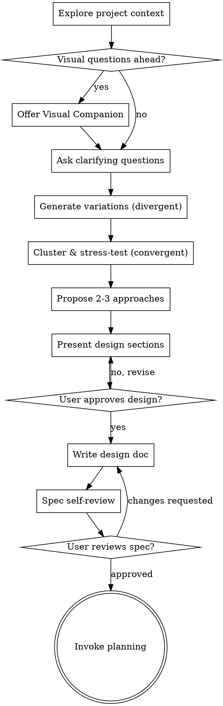

# Idea Refine

Refines raw ideas into sharp, actionable concepts worth building through structured divergent and convergent thinking.

<HARD-GATE>
Do NOT invoke any implementation skill, write any code, scaffold any project, or take any implementation action until you have presented a design and the user has approved it. This applies to EVERY project regardless of perceived simplicity.
</HARD-GATE>

## Anti-Pattern: "This Is Too Simple To Need A Design"

Every project goes through this process. A todo list, a single-function utility, a config change — all of them. "Simple" projects are where unexamined assumptions cause the most wasted work. The design can be short (a few sentences for truly simple projects), but you MUST present it and get approval.

## Checklist

You MUST create a task for each of these items and complete them in order:

1. **Explore project context** — check files, docs, recent commits
2. **Offer visual companion** (if topic will involve visual questions) — this is its own message, not combined with a clarifying question
3. **Ask clarifying questions** — one at a time, understand purpose/constraints/success criteria
4. **Generate idea variations** — 5-8 variations using divergent thinking lenses
5. **Propose 2-3 approaches** — with trade-offs and your recommendation
6. **Present design** — in sections scaled to complexity, get user approval after each section
7. **Write design doc** — save to `docs/rein/changes/<name>/refine.md` and commit
8. **Spec self-review** — quick inline check for placeholders, contradictions, ambiguity, scope
9. **User reviews written spec** — ask user to review the spec file before proceeding
10. **Transition to implementation** — invoke planning skill

## Process Flow



**The terminal state is invoking planning.** Do NOT invoke any implementation skill. The ONLY skill you invoke after refine is planning.

## Phase 1: Understand & Expand (Divergent)

**Goal:** Take the raw idea and open it up.

1. **Explore project context first** — check files, docs, recent commits
2. **Assess scope:** If the request describes multiple independent subsystems, flag this immediately. Help the user decompose into sub-projects before refining details.
3. **Restate the idea** as a crisp "How Might We" problem statement. This forces clarity on what's actually being solved.
4. **Ask 3-5 sharpening questions** — one at a time. Focus on:
   - Who is this for, specifically?
   - What does success look like?
   - What are the real constraints (time, tech, resources)?
   - What's been tried before?
   - Why now?

5. **Generate 5-8 idea variations** using these lenses:
   - **Inversion:** "What if we did the opposite?"
   - **Constraint removal:** "What if budget/time/tech weren't factors?"
   - **Audience shift:** "What if this were for [different user]?"
   - **Combination:** "What if we merged this with [adjacent idea]?"
   - **Simplification:** "What's the version that's 10x simpler?"
   - **10x version:** "What would this look like at massive scale?"
   - **Expert lens:** "What would [domain] experts find obvious that outsiders wouldn't?"

   Push beyond what the user initially asked for. Create products people don't know they need yet.

**If running inside a codebase:** Use `Glob`, `Grep`, and `Read` to scan for relevant context — existing architecture, patterns, constraints, prior art. Ground your variations in what actually exists.

Read `frameworks.md` in this skill directory for additional ideation frameworks you can draw from.

## Phase 2: Evaluate & Converge

After the user reacts to Phase 1, shift to convergent mode:

1. **Cluster** the ideas that resonated into 2-3 distinct directions. Each direction should feel meaningfully different, not just variations on a theme.

2. **Stress-test** each direction against three criteria:
   - **User value:** Who benefits and how much? Is this a painkiller or a vitamin?
   - **Feasibility:** What's the technical and resource cost? What's the hardest part?
   - **Differentiation:** What makes this genuinely different? Would someone switch from their current solution?

   Read `refinement-criteria.md` in this skill directory for the full evaluation rubric.

3. **Surface hidden assumptions.** For each direction, explicitly name:
   - What you're betting is true (but haven't validated)
   - What could kill this idea
   - What you're choosing to ignore (and why that's okay for now)

4. **Propose 2-3 approaches** with trade-offs and your recommendation. Lead with your recommended option and explain why.

**Be honest, not supportive.** If an idea is weak, say so with kindness. A good ideation partner is not a yes-machine.

## Phase 3: Sharpen & Ship

Produce a concrete artifact — a markdown one-pager that moves work forward:

```markdown
# [Idea Name]

## Problem Statement
[One-sentence "How Might We" framing]

## Recommended Direction
[The chosen direction and why — 2-3 paragraphs max]

## Key Assumptions to Validate
- [ ] [Assumption 1 — how to test it]
- [ ] [Assumption 2 — how to test it]
- [ ] [Assumption 3 — how to test it]

## MVP Scope
[The minimum version that tests the core assumption. What's in, what's out.]

## Not Doing (and Why)
- [Thing 1] — [reason]
- [Thing 2] — [reason]
- [Thing 3] — [reason]

## Open Questions
- [Question that needs answering before building]
```

**The "Not Doing" list is arguably the most valuable part.** Focus is about saying no to good ideas. Make the trade-offs explicit.

## After the Design

**Documentation:**
- Write the validated design (spec) to `docs/rein/changes/<name>/refine.md`
- Commit the design document to git

**Spec Self-Review:**
After writing the spec document, look at it with fresh eyes:

1. **Placeholder scan:** Any "TBD", "TODO", incomplete sections, or vague requirements? Fix them.
2. **Internal consistency:** Do any sections contradict each other? Does the architecture match the feature descriptions?
3. **Scope check:** Is this focused enough for a single implementation plan, or does it need decomposition?
4. **Ambiguity check:** Could any requirement be interpreted two different ways? If so, pick one and make it explicit.

Fix any issues inline.

**User Review Gate:**
After the spec review loop passes, ask the user to review the written spec before proceeding:

> "Spec written and committed to `<path>`. Please review it and let me know if you want to make any changes before we start writing out the implementation plan."

Wait for the user's response. If they request changes, make them and re-run the spec review loop. Only proceed once the user approves.

**Implementation:**
- Invoke the planning skill to create a detailed implementation plan
- Do NOT invoke any other skill. planning is the next step.

## Key Principles

- **One question at a time** — Don't overwhelm with multiple questions
- **Multiple choice preferred** — Easier to answer than open-ended when possible
- **YAGNI ruthlessly** — Remove unnecessary features from all designs
- **Explore alternatives** — Always propose 2-3 approaches before settling
- **Incremental validation** — Present design, get approval before moving on
- **Surface assumptions** — Untested assumptions are the #1 killer of good ideas
- **Not Doing list is mandatory** — Focus is about saying no to good ideas
- **Design for isolation and clarity** — Break systems into smaller units with one clear purpose

## Anti-patterns

- Generating 20+ shallow variations instead of 5-8 considered ones
- Skipping the "who is this for" question
- No assumptions surfaced before committing to a direction
- Yes-machining weak ideas instead of pushing back with specificity
- Producing a plan without a "Not Doing" list
- Ignoring existing codebase constraints when ideating inside a project
- Jumping to output without running the full process
- Unrelated refactoring proposals — stay focused on what serves the current goal

## Verification

After completing an ideation session:

- [ ] A clear "How Might We" problem statement exists
- [ ] The target user and success criteria are defined
- [ ] Multiple directions were explored, not just the first idea
- [ ] Hidden assumptions are explicitly listed with validation strategies
- [ ] A "Not Doing" list makes trade-offs explicit
- [ ] The output is a concrete artifact (markdown one-pager), not just conversation
- [ ] The user confirmed the final direction before any implementation work
- [ ] The spec has no placeholders, contradictions, or ambiguity
