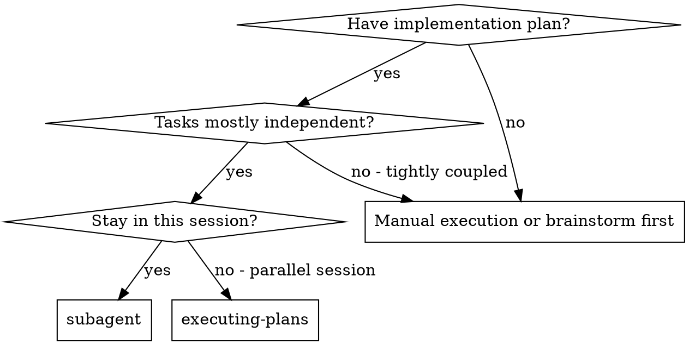
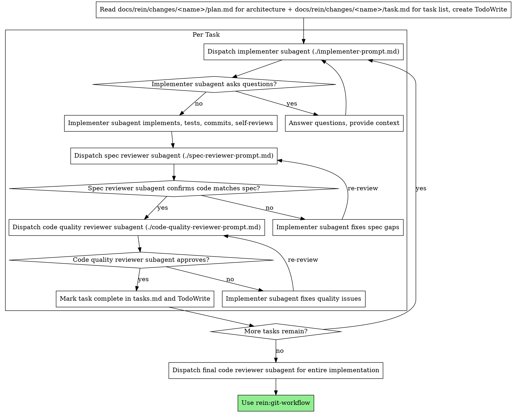
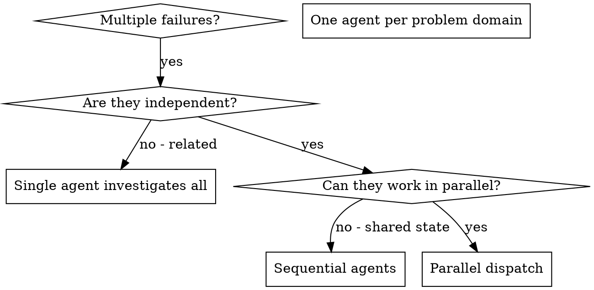

# Subagent-Driven Development

Execute plan by dispatching fresh subagent per task, with two-stage review after each: spec compliance review first, then code quality review. When facing multiple independent problems, dispatch agents in parallel.

**Why subagents:** You delegate tasks to specialized agents with isolated context. By precisely crafting their instructions and context, you ensure they stay focused and succeed at their task. They should never inherit your session's context or history — you construct exactly what they need. This also preserves your own context for coordination work.

**Core principle:** Fresh subagent per task + two-stage review (spec then quality) = high quality, fast iteration

## When to Use



## Sequential Execution: The Process



## Parallel Dispatch

When you have multiple unrelated failures or independent problems, dispatch one agent per independent problem domain. Let them work concurrently.

### When to Use Parallel Dispatch



**Use when:**
- 3+ test files failing with different root causes
- Multiple subsystems broken independently
- Each problem can be understood without context from others
- No shared state between investigations

**Don't use when:**
- Failures are related (fix one might fix others)
- Need to understand full system state
- Agents would interfere with each other

### The Pattern

1. **Identify Independent Domains** — Group failures by what's broken. Each domain is independent.
2. **Create Focused Agent Tasks** — Each agent gets specific scope, clear goal, constraints, and expected output.
3. **Dispatch in Parallel** — All agents run concurrently.
4. **Review and Integrate** — Read summaries, verify no conflicts, run full test suite.

### Agent Prompt Structure

Good agent prompts are:
1. **Focused** - One clear problem domain
2. **Self-contained** - All context needed to understand the problem
3. **Specific about output** - What should the agent return?

```markdown
Fix the 3 failing tests in src/agents/agent-tool-abort.test.ts:

1. "should abort tool with partial output capture" - expects 'interrupted at' in message
2. "should handle mixed completed and aborted tools" - fast tool aborted instead of completed
3. "should properly track pendingToolCount" - expects 3 results but gets 0

These are timing/race condition issues. Your task:

1. Read the test file and understand what each test verifies
2. Identify root cause - timing issues or actual bugs?
3. Fix by:
   - Replacing arbitrary timeouts with event-based waiting
   - Fixing bugs in abort implementation if found
   - Adjusting test expectations if testing changed behavior

Do NOT just increase timeouts - find the real issue.

Return: Summary of what you found and what you fixed.
```

### Common Mistakes

**❌ Too broad:** "Fix all the tests" - agent gets lost
**✅ Specific:** "Fix agent-tool-abort.test.ts" - focused scope

**❌ No context:** "Fix the race condition" - agent doesn't know where
**✅ Context:** Paste the error messages and test names

**❌ No constraints:** Agent might refactor everything
**✅ Constraints:** "Do NOT change production code" or "Fix tests only"

**❌ Vague output:** "Fix it" - you don't know what changed
**✅ Specific:** "Return summary of root cause and changes"

## Model Selection

Use the least powerful model that can handle each role to conserve cost and increase speed.

**Mechanical implementation tasks** (isolated functions, clear specs, 1-2 files): use a fast, cheap model.

**Integration and judgment tasks** (multi-file coordination, pattern matching, debugging): use a standard model.

**Architecture, design, and review tasks**: use the most capable available model.

## Handling Implementer Status

Implementer subagents report one of four statuses. Handle each appropriately:

**DONE:** Proceed to spec compliance review.

**DONE_WITH_CONCERNS:** Read the concerns before proceeding. If about correctness or scope, address them. If observations, note and proceed.

**NEEDS_CONTEXT:** Provide the missing context and re-dispatch.

**BLOCKED:** Assess the blocker:
1. Context problem → provide more context and re-dispatch with same model
2. Task needs more reasoning → re-dispatch with more capable model
3. Task too large → break into smaller pieces
4. Plan is wrong → escalate to the human

**Never** ignore an escalation or force the same model to retry without changes.

## Task Status Tracking (MANDATORY)

**IRON RULE: A task is NOT complete until its checkbox in tasks.md is updated AND verified.** Moving to the next task without updating tasks.md is a process violation.

During execution, use **plan.md** as the implementation reference and **tasks.md** for status tracking:

- **plan.md** → HOW: Include full task details when dispatching implementer subagents
- **tasks.md** → STATUS: After each task is verified complete, the controller MUST update the checkbox

**After each task is verified complete**, the controller executes this two-step sequence — **both steps are required**:

1. **Edit** `docs/rein/changes/<name>/task.md` — change the task's `- [ ]` to `- [x]`
2. **Read** the same file back — confirm the checkbox now shows `- [x]`. If not, fix it immediately.

Only after both steps are done may you proceed to the next task.

**This applies even when:**
- Skipping reviews for XS tasks (still must update tasks.md)
- The task was trivial (still must update tasks.md)
- You plan to batch multiple tasks (update each one as it completes)
- A subagent reports completion (the controller updates tasks.md, not the subagent)

The tasks.md checkbox state is the **single source of truth** for progress — `/continue` relies on it to determine resume points and current phase.

## Prompt Templates

- `./implementer-prompt.md` - Dispatch implementer subagent
- `./spec-reviewer-prompt.md` - Dispatch spec compliance reviewer subagent
- `./code-quality-reviewer-prompt.md` - Dispatch code quality reviewer subagent

## Advantages

**vs. Manual execution:**
- Subagents follow TDD naturally
- Fresh context per task (no confusion)
- Parallel-safe (subagents don't interfere)
- Subagent can ask questions (before AND during work)

**vs. Executing Plans:**
- Same session (no handoff)
- Continuous progress (no waiting)
- Review checkpoints automatic

**Quality gates:**
- Self-review catches issues before handoff
- Two-stage review: spec compliance, then code quality
- Review loops ensure fixes actually work
- Spec compliance prevents over/under-building
- Code quality ensures implementation is well-built

## Red Flags

**Never:**
- Start implementation on main/master branch without explicit user consent
- **Move to the next task without updating tasks.md checkbox** (IRON RULE)
- Skip reviews (spec compliance OR code quality)
- Proceed with unfixed issues
- Dispatch multiple implementation subagents in parallel (conflicts)
- Make subagent read plan file (provide full text instead)
- Skip scene-setting context (subagent needs to understand where task fits)
- Ignore subagent questions (answer before letting them proceed)
- Accept "close enough" on spec compliance (spec reviewer found issues = not done)
- Skip review loops (reviewer found issues = implementer fixes = review again)
- Let implementer self-review replace actual review (both are needed)
- **Start code quality review before spec compliance is ✅** (wrong order)
- Move to next task while either review has open issues

## Integration

**Required workflow skills:**
- **git-workflow** - Set up isolated workspace before starting; complete development after all tasks
- **planning** - Creates the plan this skill executes
- **tdd** - Subagents follow TDD for each task

**Alternative workflow:**
- **executing-plans** - Use for inline execution without subagent dispatch
