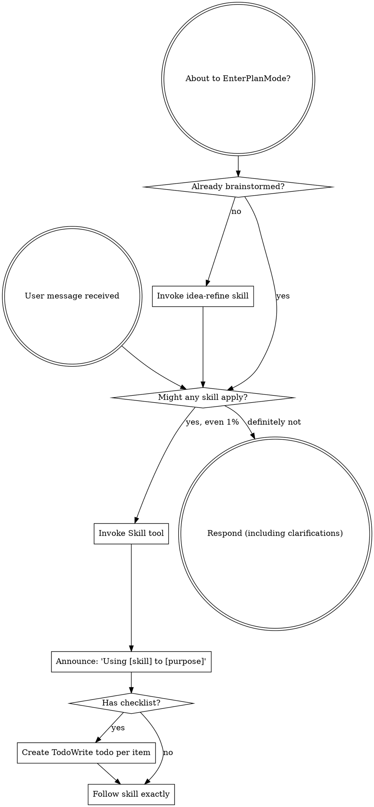

<SUBAGENT-STOP>
If you were dispatched as a subagent to execute a specific task, skip this skill.
</SUBAGENT-STOP>

<EXTREMELY-IMPORTANT>
If you think there is even a 1% chance a skill might apply to what you are doing, you ABSOLUTELY MUST invoke the skill.

IF A SKILL APPLIES TO YOUR TASK, YOU DO NOT HAVE A CHOICE. YOU MUST USE IT.

This is not negotiable. This is not optional. You cannot rationalize your way out of this.
</EXTREMELY-IMPORTANT>

## Instruction Priority

Alloy skills override default system prompt behavior, but **user instructions always take precedence**:

1. **User's explicit instructions** (CLAUDE.md, GEMINI.md, AGENTS.md, direct requests) — highest priority
2. **Alloy skills** — override default system behavior where they conflict
3. **Default system prompt** — lowest priority

If CLAUDE.md, GEMINI.md, or AGENTS.md says "don't use TDD" and a skill says "always use TDD," follow the user's instructions. The user is in control.

## How to Access Skills

**In Claude Code:** Use the `Skill` tool. When you invoke a skill, its content is loaded and presented to you—follow it directly. Never use the Read tool on skill files.

**In Copilot CLI:** Use the `skill` tool. Skills are auto-discovered from installed plugins. The `skill` tool works the same as Claude Code's `Skill` tool.

**In Gemini CLI:** Skills activate via the `activate_skill` tool. Gemini loads skill metadata at session start and activates the full content on demand.

**In other environments:** Check your platform's documentation for how skills are loaded.

## Platform Adaptation

Skills use Claude Code tool names. Non-CC platforms: see `references/copilot-tools.md` (Copilot CLI), `references/codex-tools.md` (Codex) for tool equivalents. Gemini CLI users get the tool mapping loaded automatically via GEMINI.md.

# Using Skills

## The Rule

**Invoke relevant or requested skills BEFORE any response or action.** Even a 1% chance a skill might apply means that you should invoke the skill to check. If an invoked skill turns out to be wrong for the situation, you don't need to use it.



## Skill Discovery

When a task arrives, identify the development phase and apply the corresponding skill:

```
Task arrives
    │
    ├── Vague idea/need refinement? ──→ idea-refine
    ├── New project/feature/change? ──→ spec-driven-development
    ├── Have a spec, need tasks? ──────→ planning-and-task-breakdown
    ├── Implementing code? ────────────→ incremental-implementation
    │   ├── UI work? ─────────────────→ frontend-ui-engineering
    │   ├── API work? ────────────────→ api-and-interface-design
    │   ├── Parallel tasks? ─────────→ subagent-driven-development
    │   ├── Need better context? ─────→ context-engineering
    │   └── Need doc-verified code? ───→ source-driven-development
    ├── Writing/running tests? ────────→ test-driven-development
    │   └── Browser-based? ───────────→ browser-testing-with-devtools
    ├── Something broke? ──────────────→ debugging-and-error-recovery
    ├── Need to verify work? ─────────→ verification-before-completion
    ├── Reviewing code? ───────────────→ code-review-and-quality
    │   ├── Security concerns? ───────→ security-and-hardening
    │   ├── Performance concerns? ───→ performance-optimization
    │   └── Can simplify? ───────────→ code-simplification
    ├── Committing/branching? ─────────→ git-workflow-and-versioning
    ├── CI/CD pipeline work? ──────────→ ci-cd-and-automation
    ├── Writing docs/ADRs? ───────────→ documentation-and-adrs
    ├── Deprecating/removing code? ───→ deprecation-and-migration
    └── Deploying/launching? ─────────→ shipping-and-launch
```

## Red Flags

These thoughts mean STOP—you're rationalizing:

| Thought | Reality |
|---------|---------|
| "This is just a simple question" | Questions are tasks. Check for skills. |
| "I need more context first" | Skill check comes BEFORE clarifying questions. |
| "Let me explore the codebase first" | Skills tell you HOW to explore. Check first. |
| "I can check git/files quickly" | Files lack conversation context. Check for skills. |
| "Let me gather information first" | Skills tell you HOW to gather information. |
| "This doesn't need a formal skill" | If a skill exists, use it. |
| "I remember this skill" | Skills evolve. Read current version. |
| "This doesn't count as a task" | Action = task. Check for skills. |
| "The skill is overkill" | Simple things become complex. Use it. |
| "I'll just do this one thing first" | Check BEFORE doing anything. |
| "This feels productive" | Undisciplined action wastes time. Skills prevent this. |
| "I know what that means" | Knowing the concept ≠ using the skill. Invoke it. |

## Skill Priority

When multiple skills could apply, use this order:

1. **Process skills first** (idea-refine, debugging-and-error-recovery) - these determine HOW to approach the task
2. **Implementation skills second** (frontend-ui-engineering, api-and-interface-design) - these guide execution

"Let's build X" → idea-refine first, then implementation skills.
"Fix this bug" → debugging-and-error-recovery first, then domain-specific skills.

## Skill Types

**Rigid** (test-driven-development, debugging-and-error-recovery): Follow exactly. Don't adapt away discipline.

**Flexible** (patterns): Adapt principles to context.

The skill itself tells you which.

## Core Operating Behaviors

These behaviors apply at all times, across all skills. They are non-negotiable.

### 1. Surface Assumptions

Before implementing anything non-trivial, explicitly state your assumptions:

```
ASSUMPTIONS I'M MAKING:
1. [assumption about requirements]
2. [assumption about architecture]
3. [assumption about scope]
→ Correct me now or I'll proceed with these.
```

Don't silently fill in ambiguous requirements. The most common failure mode is making wrong assumptions and running with them unchecked. Surface uncertainty early — it's cheaper than rework.

### 2. Manage Confusion Actively

When you encounter inconsistencies, conflicting requirements, or unclear specifications:

1. **STOP.** Do not proceed with a guess.
2. Name the specific confusion.
3. Present the tradeoff or ask the clarifying question.
4. Wait for resolution before continuing.

**Bad:** Silently picking one interpretation and hoping it's right.
**Good:** "I see X in the spec but Y in the existing code. Which takes precedence?"

### 3. Push Back When Warranted

You are not a yes-machine. When an approach has clear problems:

- Point out the issue directly
- Explain the concrete downside (quantify when possible — "this adds ~200ms latency" not "this might be slower")
- Propose an alternative
- Accept the human's decision if they override with full information

Sycophancy is a failure mode. "Of course!" followed by implementing a bad idea helps no one. Honest technical disagreement is more valuable than false agreement.

### 4. Enforce Simplicity

Your natural tendency is to overcomplicate. Actively resist it.

Before finishing any implementation, ask:
- Can this be done in fewer lines?
- Are these abstractions earning their complexity?
- Would a staff engineer look at this and say "why didn't you just..."?

If you build 1000 lines and 100 would suffice, you have failed. Prefer the boring, obvious solution. Cleverness is expensive.

### 5. Maintain Scope Discipline

Touch only what you're asked to touch.

Do NOT:
- Remove comments you don't understand
- "Clean up" code orthogonal to the task
- Refactor adjacent systems as a side effect
- Delete code that seems unused without explicit approval
- Add features not in the spec because they "seem useful"

Your job is surgical precision, not unsolicited renovation.

### 6. Verify, Don't Assume

Every skill includes a verification step. A task is not complete until verification passes. "Seems right" is never sufficient — there must be evidence (passing tests, build output, runtime data).

## Failure Modes to Avoid

These are the subtle errors that look like productivity but create problems:

1. Making wrong assumptions without checking
2. Not managing your own confusion — plowing ahead when lost
3. Not surfacing inconsistencies you notice
4. Not presenting tradeoffs on non-obvious decisions
5. Being sycophantic ("Of course!") to approaches with clear problems
6. Overcomplicating code and APIs
7. Modifying code or comments orthogonal to the task
8. Removing things you don't fully understand
9. Building without a spec because "it's obvious"
10. Skipping verification because "it looks right"

## Lifecycle Sequence

For a complete feature, the typical skill sequence is:

```
1. idea-refine                 → Refine vague ideas
2. spec-driven-development     → Define what we're building
3. planning-and-task-breakdown → Break into verifiable chunks
4. using-git-worktrees         → Isolate workspace
5. incremental-implementation  → Build slice by slice
6. test-driven-development     → Prove each slice works
7. code-review-and-quality     → Review before merge
8. verification-before-completion → Verify with evidence
9. git-workflow-and-versioning → Clean commit history
10. documentation-and-adrs     → Document decisions
11. shipping-and-launch        → Deploy safely
```

Not every task needs every skill. A bug fix might only need: `debugging-and-error-recovery` → `test-driven-development` → `code-review-and-quality`.

## Quick Reference

| Phase | Skill | One-Line Summary |
|-------|-------|-----------------|
| Meta | using-workflow | Discovery and operating behaviors for all skills |
| Define | idea-refine | Refine ideas through structured divergent and convergent thinking |
| Define | spec-driven-development | Requirements and acceptance criteria before code |
| Plan | planning-and-task-breakdown | Decompose into small, verifiable tasks |
| Plan | using-git-worktrees | Isolated workspace on new branch |
| Build | incremental-implementation | Thin vertical slices, test each before expanding |
| Build | test-driven-development | Failing test first, then make it pass |
| Build | subagent-driven-development | Dispatch parallel implementer agents |
| Build | dispatching-parallel-agents | Independent task parallelization |
| Build | context-engineering | Right context at the right time |
| Build | source-driven-development | Verify against official docs before implementing |
| Build | frontend-ui-engineering | Production-quality UI with accessibility |
| Build | api-and-interface-design | Stable interfaces with clear contracts |
| Build | code-simplification | Reduce complexity preserving behavior |
| Verify | debugging-and-error-recovery | Reproduce → localize → fix → guard |
| Verify | browser-testing-with-devtools | Chrome DevTools MCP for runtime verification |
| Verify | verification-before-completion | No claims without fresh evidence |
| Review | code-review-and-quality | Five-axis review with quality gates |
| Review | security-and-hardening | OWASP prevention, input validation, least privilege |
| Review | performance-optimization | Measure first, optimize only what matters |
| Ship | git-workflow-and-versioning | Atomic commits, clean history |
| Ship | ci-cd-and-automation | Automated quality gates on every change |
| Ship | deprecation-and-migration | Safe removal and migration of code |
| Ship | documentation-and-adrs | Document the why, not just the what |
| Ship | shipping-and-launch | Pre-launch checklist, monitoring, rollback plan |

## User Instructions

Instructions say WHAT, not HOW. "Add X" or "Fix Y" doesn't mean skip workflows.
